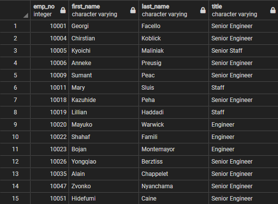
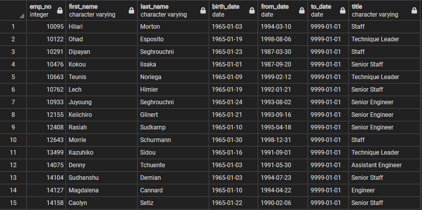
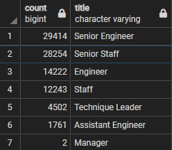
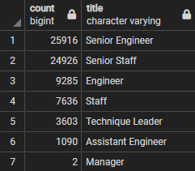

# Pewlett-Hackard-Analysis

## Overview of the analysis:
For our analysis of the Pewlett-Hackard employees, we noticed that there were a lot of employees who were of the age of nearing retirement. We created a `unique_titles.csv` that contained the employee number, name, and title of employees who were born between 1952 and 1955. With this table, we were able to create the `retiring_titles.csv` which contained the number of employees for each job title that fell within the age for retiring employees. This gave us an idea of the number of employees that need to be replaced when they decide to retire. We then created a `mentorship_eligibility.csv` file that contained the information of employees who were slightly younger, born in 1965, who are eligible to mentor the next generation of employees to replace those who will be retiring soon.

## Results: 
Shown below are the first 15 rows of the `unique_titles` and `mentorship_eligibility` tables from deliverables 1 and 2, respectively. 
- Within the `unique_titles` table, we have included all employees that were born between 1952 and 1955. This includes employees that are no longer with the company.
- To have a better understanding about who in the company will be retiring, we should create another table that includes those born between 1952 and 1955 and are still employed by the company. This table will be called `active_unique_titles`.
- The `mentorship_eligibility` table only includes current employees who were born in the year 1965, but excludes all those who were included in the `unique_titles` table.
- To include the older, and possibly more experienced employees who are ready for retirement in the `mentorship_eligibility` table, we should expand the birth date from 1952-1965 for `mentorship_eligibility`. This more inclusive table will be called `extended_mentorship_eligibility`.

## Summary:
- How many roles will need to be filled as the "silver tsunami" begins to make an impact?
  - Adjusting the `unique_titles` to only include current employees, we created the `active_unique_titles` table. From here we created the `active_retiring_titles` table to include the employees who are of retirement age and are active employees. Shown below is the comparison to the `retiring_titles` and `active_retiring_titles`, respectively. From the `active_retiring_titles`, we can see that there are 72,458 active employees who fall within the age range of potential retirees.

- Are there enough qualified, retirement-ready employees in the departments to mentor the next generation of Pewlett Hackard employees?
 - Using the `mentorship_eligibility` table, we have 1549 eligible mentors to train the incoming generation to fill the positions of those retiring. Unfortunately, this may not be enough, givin that there are 72,458 employees potentially retiring. To gain more eligible mentors, we can expand the range of the birth date requirement for mentorship eligibility. Creating a new table, `extended_mentorship_eligibility`, we can expand the age range for mentors. Instead of restricting mentors to employees born in 1965, we can extend this to those born from 1952-1965. This will give those who are considering retiring soon the opportunity to mentor some of their replacements and allow those born up to 1965 the time to mentor several incoming employees before it is their time to retire. From the `extended_mentorship_eligibility` table, there are 240,124 employees eligible to mentor the next generation of Pewlett-Hackard employees. With this many eligible to mentor, there will be more than enough mentors to train replacements.